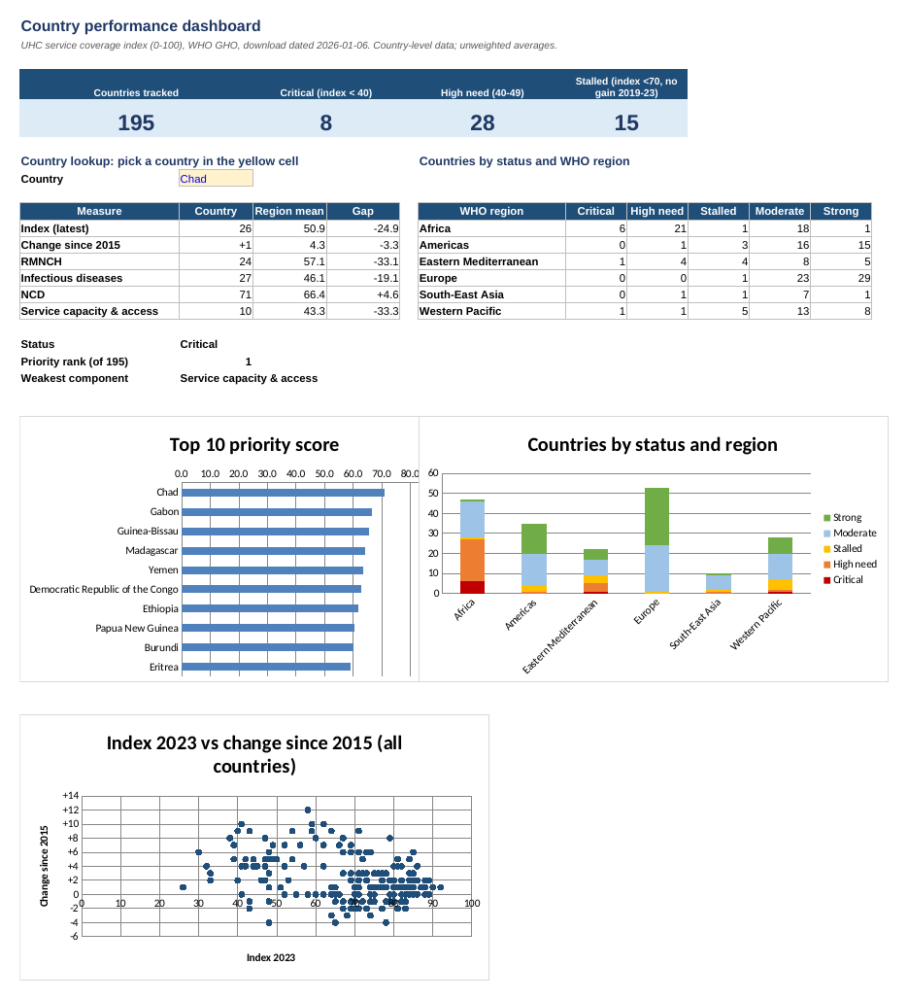

# Health Service Coverage Performance Tracker

A country-level performance tracker built from WHO data, showing where essential health service coverage is weakest and which countries need attention first.

## Business challenge

A regional health ministry oversees outpatient care across public health facilities in several African countries. Leadership has seen wide variation in patient volumes and service delivery but has no consolidated view of what is happening on the ground. Programme managers need one clear, comparable picture they can read in five minutes and use for resource planning.

**Data scope:** no facility-level export was available. This project therefore uses WHO country-level service coverage data (195 countries, 2000–2023) to build the tracker, the scoring logic and the dashboard. The same structure can take facility-level data once the ministry supplies it.

## Key findings

- **Progress has slowed:** the average country score rose from 55.3 in 2000 to 66.2 in 2015 but only to 68.4 by 2023, and 72 of 195 countries made no gain between 2019 and 2023.
- **Low coverage is concentrated in Africa:** 36 countries score below 50 (8 Critical, 28 High need), and 27 of them are in Africa. Service capacity and infectious disease coverage are the weakest areas there.
- **Three countries need attention first:** Chad (index 26, barely moving), Gabon (48, down 4 points since 2015) and Guinea-Bissau (43, down 2 points).

**Recommended next step:** within 30 days, hold a focused review for those three countries, confirm the figures with national health information teams, and agree one costed action per country. In the same exercise, request facility-level outpatient data so the next version can show which facilities drive the gap. The full write-up is in [`Summary_One_Page.md`](Summary_One_Page.md).

## Screenshots

**Key charts: dashboard tiles, top 10 priority score, status by region, progress vs level**



## Tools used

- **Python** (pandas, openpyxl) to clean, merge and build the workbook
- **Spreadsheet formulas** (`SUMIFS`, `AVERAGEIFS`, `COUNTIFS`, `INDEX/MATCH`, `RANK`) so every figure recalculates in Excel and Google Sheets
- **LibreOffice** to recalculate and check the workbook and render the screenshots
- **Google Sheets / Excel** to open and share the final workbook

## Dataset source

- **WHO Global Health Observatory (GHO):** <https://www.who.int/data/gho>
- Theme: Service coverage index and components (SDG 3.8.1), downloaded 2026-01-06
- Indicators used: `UHC_INDEX_REPORTED`, `UHC_SCI_RMNCH`, `UHC_SCI_INFECT`, `UHC_SCI_NCD`, `UHC_SCI_CAPACITY`, `UHC_AVAILABILITY_SCORE`
- The source files are not included in this repository; see [`data/raw/README.md`](data/raw/README.md) for the link and indicator codes.

## Repository structure

```
healthcare-facility-performance-tracker/
├── data/
│   └── raw/                 <- link to source, not the file itself
│       └── README.md
├── sheets/
│   └── healthcare-facility-performance-tracker.xlsx   <- exported copy of the Google Sheet
├── images/
│   └── chart_screenshots.png
├── Summary_One_Page.md      <- one-page findings and recommended next step
└── README.md
```

Import the workbook into Google Sheets via File > Import.

## Workbook tabs

| Tab | Contents |
|---|---|
| Priority | Top 3 countries, rationale, recommended next step, top 10 list |
| Dashboard | Status tiles, status-by-region table, three charts, country lookup (yellow cell) |
| Tracker | One row per country: index, change, sub-indices, weakest component, priority score, rank, status |
| Assumptions | Editable weights and thresholds, suggested focus by component |
| Cleaning Log | Every cleaning step and check |
| Raw Data | 4,680 country-year rows (index and four sub-indices) |

## Method

1. Kept country rows only and dropped WHO aggregates (480 rows per file).
2. Dropped 11 empty columns and administrative fields.
3. Joined country names and WHO regions by ISO3 code (195 of 195 matched).
4. Merged the five indicators by country and year; checked duplicates, blanks and 0–100 ranges (none found).
5. **Priority score** = 70% × (100 − index 2023) + 30% × momentum score. Momentum rises as progress since 2015 falls: a gain of 10 or more points scores 0, a change of −4 or worse scores 100.
6. **Status:** Critical (index below 40), High need (40–49), Stalled (no gain 2019–23 and index below 70), Moderate (below 80), Strong (80 or above).

## Limitations

- Country-level data only; no facility names, visit counts or staffing fields.
- Values are whole numbers with no confidence intervals, so a 1-point change is within rounding.
- Primary data availability averages 64%, and 29 countries have under 50%, so some scores rest on modelled data.
- The index measures service coverage, not financial protection (SDG 3.8.2).
- Country averages are unweighted, and the ranking depends on the 70/30 weighting (editable on the Assumptions tab).

## Publishing to GitHub

```bash
git init
git add .
git commit -m "Add health service coverage tracker"
git branch -M main
git remote add origin https://github.com/<your-username>/<repo-name>.git
git push -u origin main
```
